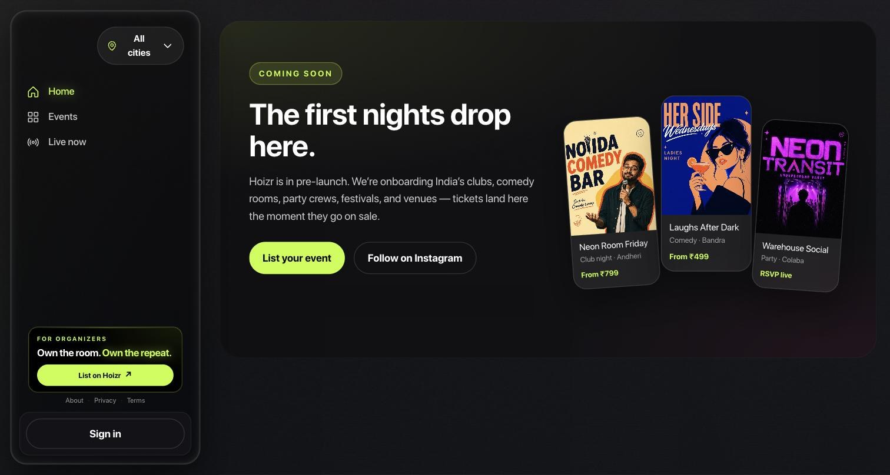
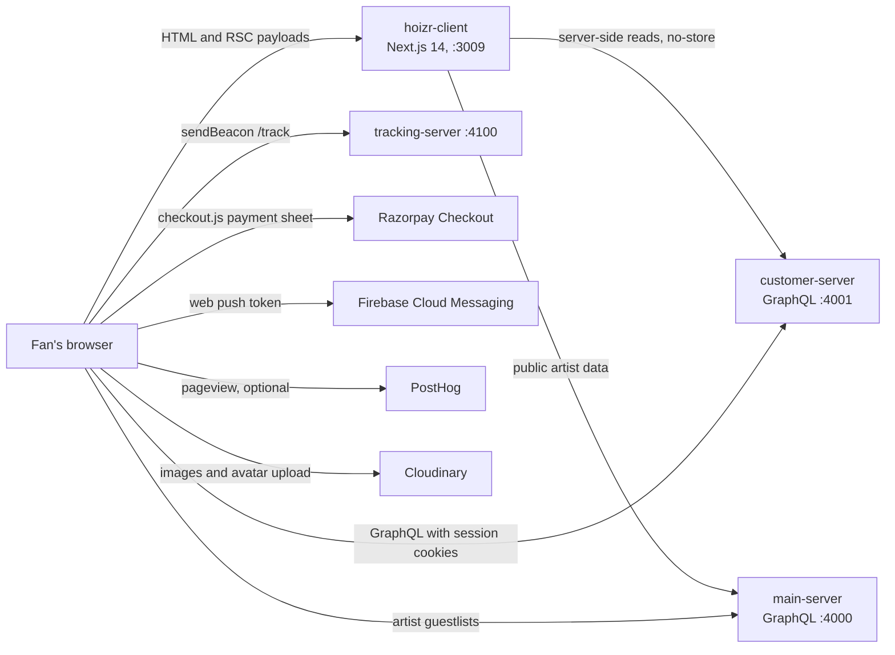
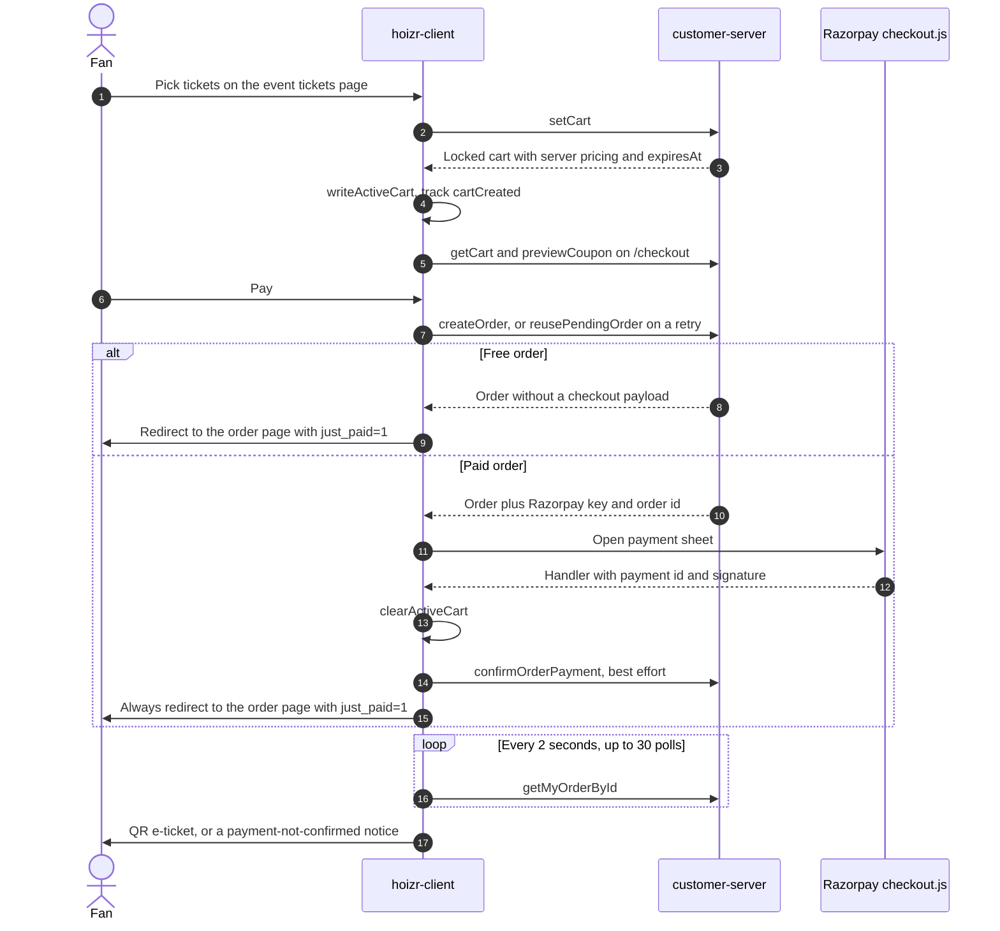

<div align="center">

# Hoizr storefront (hoizr-client)

The fan-facing storefront for Hoizr: discover live events across India, book tickets and keep QR e-tickets.

[Hoizr walkthrough](https://github.com/roop37/hoizr-walkthrough) · [Architecture](https://github.com/roop37/hoizr-walkthrough/blob/main/docs/01-system-architecture.md) · [Local setup](https://github.com/roop37/hoizr-walkthrough/blob/main/docs/09-local-development.md) · [Contributing](https://github.com/roop37/hoizr-dotgithub/blob/main/CONTRIBUTING.md)


</div>



<!-- SCREENSHOT: customer-eticket | Order detail page for a paid order: QR e-ticket, event summary, invoice and share buttons -->
<!-- SCREENSHOT: customer-checkout | Checkout page with a locked cart, promo code field, price breakdown and the Razorpay pay button -->

## About

`hoizr-client` is the web app that ticket buyers use. Fans browse events, artists and venues, lock tickets in a server-held cart, pay through Razorpay Checkout, and receive a QR e-ticket that door staff scan with the Hoizr scanner app. Venues and event organizers create those events in [business-client](https://github.com/roop37/business-client); this repo reads them and places orders through [customer-server](https://github.com/roop37/customer-server).

It is a Next.js 14 App Router site. Public pages render on the server so search engines get full HTML, and personalised data (orders, profile, guestlist passes) loads in the browser with the customer's session cookies. The app talks to two GraphQL APIs, sends first-party analytics to [tracking-server](https://github.com/roop37/tracking-server), and does not depend on the shared `@hoizr-technology/shared` package: the few constants it needs are mirrored locally. For the whole system, start with the [Hoizr walkthrough](https://github.com/roop37/hoizr-walkthrough).

## Contents

- [About](#about)
- [Highlights](#highlights)
- [Features](#features)
- [Tech stack](#tech-stack)
- [Architecture](#architecture)
- [Route map](#route-map)
- [Getting started](#getting-started)
- [Testing and quality](#testing-and-quality)
- [Known limitations](#known-limitations)
- [Contributing](#contributing)
- [Related repositories](#related-repositories)
- [Author](#author)
- [License](#license)

## Highlights

- **A payment hand-off that cannot strand a paid buyer.** Once Razorpay's success handler fires, the client clears the local cart, tries `confirmOrderPayment` as a fast path, swallows any error, and always redirects to the order page. That page polls `getMyOrderById` every 2 seconds, up to 30 times, while the webhook-driven finaliser on customer-server completes the order. A `payment.failed` event re-checks the order on the server before letting the buyer retry. See [`src/app/checkout/CheckoutClient.tsx`](src/app/checkout/CheckoutClient.tsx) and [`src/app/orders/[orderId]/OrderDetailClient.tsx`](src/app/orders/%5BorderId%5D/OrderDetailClient.tsx).
- **Retries resume the pending order.** `/checkout?retryOrderId=` calls `reusePendingOrder` instead of `createOrder`, so a second attempt resumes the existing pending order rather than starting a new one for the same purchase ([`CheckoutClient.tsx`](src/app/checkout/CheckoutClient.tsx)).
- **Server-authoritative pricing.** The ticket picker shows a preview only. The cart total, the coupon result and the amount charged all come from customer-server: `previewCoupon` runs the same pricing engine as order creation, and any quantity edit drops an applied coupon so the summary never shows a stale discount ([`CheckoutClient.tsx`](src/app/checkout/CheckoutClient.tsx)).
- **Server-rendered for crawlers, live for people.** Almost every route is `force-dynamic`, both GraphQL clients send `cache: "no-store"` plus `Cache-Control: no-cache`, and [`FreshnessRevalidate`](src/components/hoizr-ui/FreshnessRevalidate.tsx) calls `router.refresh()` when a tab regains focus (at most once per 30 seconds), so a returning visitor sees current inventory.
- **Build-safe endpoint resolution.** The GraphQL clients never throw at module load. A deployed build that still carries a `localhost` URL falls back to the known hosted endpoint and logs a console warning ([`src/lib/graphql.ts`](src/lib/graphql.ts)).
- **Multi-day ticket rules that mirror the server.** `ticketSalesClosed`, `ticketAdmitsDay` and `preselectDayId` apply the same day-ticket and all-days-pass rules the cart enforces, pinned by `node:test` cases ([`src/lib/event-days.ts`](src/lib/event-days.ts), [`src/lib/event-days.test.ts`](src/lib/event-days.test.ts)).
- **Inventory-aware SEO.** Per-route `generateMetadata`, schema.org JSON-LD (Organization, WebSite, Breadcrumb, Event with INR offers, Artist, CollectionPage) serialised with `<` escaped, a sitemap that lists city and neighbourhood pages only once they have events, `noindex` on empty city pages, RSS at `/rss.xml` and `/feed.xml`, and a [`public/llms.txt`](public/llms.txt) for AI crawlers. See [`src/app/sitemap.ts`](src/app/sitemap.ts) and [`src/components/hoizr-ui/seo/JsonLd.tsx`](src/components/hoizr-ui/seo/JsonLd.tsx).
- **An analytics SDK that never blocks a flow.** `track()` is dependency-free, posts with `navigator.sendBeacon` (falling back to `fetch` with `keepalive`), wraps every path in `try/catch`, and becomes a no-op when no tracking URL is configured. Stored UTM attribution is attached to `createOrder` ([`src/lib/tracker.ts`](src/lib/tracker.ts)).
- **A shell that survives an API outage.** City masters fall back from `ActiveCitiesWithCoords` to `ActiveCities`, then to main-server, then to a static list, so the storefront chrome still renders ([`src/lib/home-data.ts`](src/lib/home-data.ts)).

## Features

### Discover

- **Home**: a featured hero (preferring high-demand events), a "Browse by vibe" genre rail, a Tonight rail, Recently Added, a ticker, and a draggable 3D artist dome ([`DomeGallery.tsx`](src/components/hoizr-ui/DomeGallery.tsx)). With no events that carry a landscape flyer, the page shows a "Coming soon" state instead.
- **Browse** at `/events` with city, genre, date window, price band, sort and search, all synced to the URL ([`EventsPageClient.tsx`](src/components/hoizr-ui/EventsPageClient.tsx)).
- **Event detail** with three hero layouts (full-width 16:9 landscape, blurred backdrop with a portrait poster, or a gradient derived from the event id), promo codes, public guestlists, line-up and organizer cards, a venue map, and sanitised About, terms, refund and cancellation sections ([`EventDetailClient.tsx`](src/components/hoizr-ui/EventDetailClient.tsx)).
- **City pages** at `/events-in/[city]` and `/events-in/[city]/[area]`, a `/live` page for tonight and this week, and search across events, artists and venues.
- **Artists**: a searchable directory and profiles with links, merch (paid through Razorpay), riders, upcoming events, follow, and artist guestlists.
- **Venues**: list and detail pages with upcoming events, guestlists, public promo codes, and loyalty rewards a signed-in customer can claim ([`VenueCoupons.tsx`](src/components/hoizr-ui/VenueCoupons.tsx)).
- **City selection** in this order: the profile city, a cached choice, geolocation (only if permission was already granted), then a picker modal ([`CityInitializer.tsx`](src/components/hoizr-ui/CityInitializer.tsx)).

<!-- SCREENSHOT: customer-event-detail | Event detail page with the full-width landscape hero, About section, venue map and line-up cards -->

### Book and pay

- **Ticket picker** with quantity steppers clamped to the per-user limit and remaining capacity, add-ons, day chips for multi-day events, and all-days passes ([`EventBookingPanel.tsx`](src/app/events/%5Bslug%5D/EventBookingPanel.tsx)).
- **Inline sign-in** that keeps the selection: a signed-out buyer gets a sign-in sheet on the same page.
- **Server-locked cart** with an expiry, plus a floating cart bar to resume checkout from any page ([`HCartBar.tsx`](src/components/hoizr-ui/HCartBar.tsx)).
- **Promo codes** validated by the server, with the event's visible offers listed at checkout.
- **Razorpay Checkout** for paid orders. Free orders confirm without a payment sheet, and ₹0 order totals read "Free".
- **Waitlist** panel for waitlist-only events, pre-sale windows and sold-out events ([`EventWaitlistPanel.tsx`](src/app/events/%5Bslug%5D/EventWaitlistPanel.tsx)).
- **Offline payment links** at `/t/[shortCode]`: a standalone page without storefront chrome where a buyer signs in and pays for lines a venue or organizer prepared ([`OfflinePaymentClient.tsx`](src/app/t/%5BshortCode%5D/OfflinePaymentClient.tsx)).

### After purchase

- **Orders** with tabs for tickets, guestlist passes and merch ([`OrdersClient.tsx`](src/app/orders/OrdersClient.tsx)).
- **E-ticket page**: the QR code rendered from the server's `qrCodeData` (with an explicit retry state if rendering fails), invoice download with server-side generation and polling, a share sheet, a post-purchase feedback card, and a support link.
- **Guestlist golden pass** at `/guestlist/[code]` with its own QR ([`GoldenTicket.tsx`](src/components/hoizr-ui/GoldenTicket.tsx)).
- **Profile**: avatar upload, address autocomplete (Google Places through customer-server), per-channel marketing opt-ins, social handles, and followed artists.
- **Web push** through Firebase Cloud Messaging when the Firebase variables are set ([`src/lib/web-push.ts`](src/lib/web-push.ts)).

### Account

- **Phone OTP sign-in** with a `+91` default ([`AuthPanel.tsx`](src/components/auth/AuthPanel.tsx)). Google sign-in is wired but hidden in the UI; Sign in with Apple is scaffolded, not enabled.

### Behind feature flags (off by default)

- Instagram connect and "who's going" attendee avatars (`NEXT_PUBLIC_INSTA_ENABLED`).
- An optional, feature-flagged restaurant-reservation integration over Swiggy's MCP API (`NEXT_PUBLIC_SWIGGY_DINEOUT_ENABLED`). Its `/dineout` routes return 404 unless the flag is on.

## Tech stack

Versions are the ranges in [`package.json`](package.json).

| Technology | Version | Purpose here | Docs |
|---|---|---|---|
| Next.js (App Router) | `14.2.18` | Server-rendered pages, `generateMetadata`, `sitemap.ts` / `robots.ts`, RSS route handlers, `next/font/local` | [nextjs.org/docs](https://nextjs.org/docs) |
| React | `^18.3.1` | UI | [react.dev](https://react.dev) |
| TypeScript | `^5.7.3` | `strict` mode, `@/*` path alias | [typescriptlang.org/docs](https://www.typescriptlang.org/docs/) |
| graphql-request | `^7.1.2` | Two GraphQL clients (customer-server and main-server) with cookie credentials | [graffle-js/graffle](https://github.com/graffle-js/graffle) |
| GraphQL Code Generator | `^5.0.3` (CLI) | Typed SDK in `src/generated/graphql.ts` from `src/graphql/*.graphql` | [the-guild.dev/graphql/codegen](https://the-guild.dev/graphql/codegen) |
| Zustand | `^5.0.2` | Auth store and UI store (`src/store/`) | [zustand.docs.pmnd.rs](https://zustand.docs.pmnd.rs/) |
| Tailwind CSS | `^3.4.15` | Utility classes alongside a hand-written dark glass design system in `src/app/globals.css` | [v3.tailwindcss.com/docs](https://v3.tailwindcss.com/docs) |
| isomorphic-dompurify | `^2.16.0` | Sanitises organizer-authored rich text before rendering | [isomorphic-dompurify](https://github.com/kkomelin/isomorphic-dompurify) |
| qrcode | `^1.5.4` | Client-side QR canvas for e-tickets and golden passes | [node-qrcode](https://github.com/soldair/node-qrcode) |
| firebase | `^12.13.0` | Web push token registration and foreground messages | [Firebase Cloud Messaging](https://firebase.google.com/docs/cloud-messaging/js/client) |
| posthog-js | `^1.376.0` | Optional product analytics with manual `$pageview` on App Router navigation | [posthog.com/docs](https://posthog.com/docs/libraries/js) |
| framer-motion | `^12.40.0` | Reveal animations on the artist profile | [motion.dev](https://motion.dev) |
| lucide-react | `^0.469.0` | Icons | [lucide.dev](https://lucide.dev/guide/packages/lucide-react) |
| Razorpay Checkout | CDN script | Payment sheet; key and order id come from the server | [Razorpay web integration](https://razorpay.com/docs/payments/payment-gateway/web-integration/standard/) |
| blurhash + sharp (dev) | `^2.0.5` / `^0.34.5` | `scripts/generate-blurhashes.mjs`, run before `dev` and `build` | [blurha.sh](https://blurha.sh) |

## Architecture

### Folder structure

```text
hoizr-client/
├── codegen.yml                    # GraphQL Codegen: customer-server schema -> src/generated/graphql.ts
├── next.config.mjs                # permanent redirects to business.hoizr.com, Cloudinary image domains
├── tailwind.config.ts             # Tailwind theme
├── .env.example                   # every NEXT_PUBLIC_* variable, with comments
├── scripts/
│   ├── generate-blurhashes.mjs    # predev/prebuild: writes public/blurhash-manifest.json
│   └── *.test.js                  # source-text contract tests (yarn test:*)
├── public/                        # favicon, logos, OG image, llms.txt, FCM service worker
└── src/
    ├── app/                       # App Router routes (see Route map)
    │   ├── layout.tsx             # root: fonts, metadata, JSON-LD, PostHog, page-view tracker, storefront shell
    │   ├── globals.css            # dark glass design system (--h-* tokens)
    │   ├── page.tsx               # home
    │   ├── events/[slug]/         # event detail, ticket picker, booking and waitlist panels
    │   ├── checkout/              # cart review, promo codes, Razorpay hand-off, cart-editing helpers
    │   ├── orders/                # order list and e-ticket detail
    │   ├── sitemap.ts, robots.ts  # generated SEO files; rss.xml/ and feed.xml/ are route handlers
    │   └── ...                    # artist, artists, venues, guestlist, t, me, login, live, search, support, dineout
    ├── components/
    │   ├── hoizr-ui/              # storefront shell and design system: sidebar, cart bar, glass surfaces, event detail
    │   ├── auth/                  # phone OTP panel, sign-in sheet, checkout auth modal
    │   ├── analytics/             # PostHog provider, page-view tracker
    │   ├── notifications/         # web push prompt
    │   └── dineout/               # feature-flagged restaurant reservations
    ├── graphql/                   # .graphql operation documents for codegen
    ├── generated/graphql.ts       # generated typed SDK (committed)
    ├── lib/                       # GraphQL clients, queries, domain helpers, tracker, web push, unit tests
    ├── store/                     # Zustand: auth.ts and uiStore.ts
    ├── types/                     # hand-written response types
    └── utils/                     # Cloudinary avatar upload
```

### System context



- **customer-server** handles auth, cart, coupons, orders, invoices, guestlists, waitlist, venues, profile and web push tokens ([`src/lib/graphql.ts`](src/lib/graphql.ts), typed SDK in [`src/lib/sdk.ts`](src/lib/sdk.ts)).
- **main-server** serves public artist data: list, profile, links, merch, riders, events, follower counts and artist guestlists, plus a last-resort cities fallback ([`src/lib/graphql-main.ts`](src/lib/graphql-main.ts), [`src/lib/artist-queries.ts`](src/lib/artist-queries.ts)).
- **Server components** fetch public data for SEO HTML. **Client components** fetch personalised data with `credentials: "include"`, because session cookies are scoped to the API origin.
- OAuth starts for the two flagged features (Instagram and the dining integration, both off by default) are full-page navigations to the customer-server origin, so the browser sends that origin's cookies.
- Legal, about and blog paths permanently redirect to `business.hoizr.com` ([`next.config.mjs`](next.config.mjs)).

### Checkout flow



1. [`TicketSelectionClient`](src/app/events/%5Bslug%5D/tickets/TicketSelectionClient.tsx) hosts [`EventBookingPanel`](src/app/events/%5Bslug%5D/EventBookingPanel.tsx). Hidden tickets are filtered out, steppers clamp to `min(maxTicketPerUser, capacity - sold)`, and multi-day events get day chips plus all-days passes.
2. A signed-out buyer gets [`AuthSheet`](src/components/auth/AuthSheet.tsx) in place. A signed-in buyer triggers `setCart`; the response is mirrored to `localStorage` by [`writeActiveCart`](src/lib/active-cart.ts) and a `cartCreated` event (carrying `customerId`, which feeds the abandoned-cart automation) goes to tracking-server.
3. [`CheckoutClient`](src/app/checkout/CheckoutClient.tsx) requires a profile (otherwise it opens [`CheckoutAuthModal`](src/components/auth/CheckoutAuthModal.tsx)), re-locks a cart restored after sign-in, shows an expired cart up front, and lets the buyer edit quantities in place.
4. `startPayment` attaches stored UTM attribution to `createOrder`, or calls `reusePendingOrder` when `retryOrderId` is present. A free order goes straight to the order page.
5. For a paid order the Razorpay script is loaded on demand. The handler always clears the cart and redirects, and `payment.failed` checks whether the order is already `PAYMENT_SUCCESS` or `CHECKED_IN` before leaving the retry UI open. `paymentStarted` and `paymentFailed` (on dismiss) are tracked.
6. [`OrderDetailClient`](src/app/orders/%5BorderId%5D/OrderDetailClient.tsx) polls while `just_paid=1` and the order is unconfirmed, then renders the QR. If the order never confirms, it tells the buyer that any debited amount will be refunded.

### Patterns worth studying

#### The Razorpay handler always hands off

Money may already be debited when the handler runs, so the client never blocks the redirect on its own confirm call. The server's webhook path is the source of truth, and the order page waits for it. From [`src/app/checkout/CheckoutClient.tsx`](src/app/checkout/CheckoutClient.tsx#L445-L462) (catch comment shortened):

```ts
clearActiveCart();
try {
  await gqlRequest<{ confirmOrderPayment: CustomerOrderView }>(
    CONFIRM_PAYMENT_MUTATION,
    {
      razorpayOrderId: response.razorpay_order_id,
      razorpayPaymentId: response.razorpay_payment_id,
      razorpaySignature: response.razorpay_signature,
    }
  );
} catch {
  // Fast-path confirm failed — swallow and hand off to the order
  // detail page, which polls for the webhook-driven finaliser.
}
router.push(`/orders/${order._id}?just_paid=1`);
```

#### Sales windows that match the cart

A day ticket stops selling when its day starts; an all-days pass stops when the first day starts. The UI uses the same rule as the server, so a buyer is never offered a ticket the cart would reject. From [`src/lib/event-days.ts`](src/lib/event-days.ts#L29-L42):

```ts
export const ticketSalesClosed = (
  event: PublicEvent,
  ticket: PublicTicket,
  now: Date
): boolean => {
  const days = event.days ?? [];
  if (days.length === 0) return false;
  const t = now.getTime();
  if (ticket.dayId === ALL_DAYS_TICKET) {
    return t >= Math.min(...days.map((d) => ms(d.startDate)));
  }
  const day = days.find((d) => d.dayId === ticket.dayId);
  return day ? t >= ms(day.startDate) : false;
};
```

#### Endpoints that cannot break a build

An env value is used as-is unless it points at `localhost` from a deployed runtime. Next.js only inlines direct `process.env.NEXT_PUBLIC_*` references, so each client passes its variable explicitly. From [`src/lib/graphql.ts`](src/lib/graphql.ts#L33-L48) (lint directive omitted):

```ts
const resolveEndpoint = (
  envKey: string,
  value: string | undefined,
  localFallback: string,
  deployedFallback: string
) => {
  if (value && (!isLocalUrl(value) || isLocalRuntime())) return value;
  if (!isLocalRuntime()) {
    console.warn(
      `[hoizr] ${envKey} is not set for this deployment; using ${deployedFallback}`,
    );
    return deployedFallback;
  }
  return localFallback;
};
```

#### A local pointer to the server-side cart

customer-server has no "list my carts" query, so the last successful `setCart` is mirrored to `localStorage` with its expiry, and a `hoizr:active-cart-changed` `CustomEvent` tells the floating cart bar to re-read it. Expired or corrupt entries are removed on read. The server stays the source of truth during checkout ([`src/lib/active-cart.ts`](src/lib/active-cart.ts), [`HCartBar.tsx`](src/components/hoizr-ui/HCartBar.tsx)).

#### Build-time flags that keep hooks unconditional

Flagged components use the shape `FLAG ? <Inner /> : null`, so the inner component's hooks always run in the same order ([`InstagramConnectCard.tsx`](src/components/hoizr-ui/InstagramConnectCard.tsx)). Flagged routes call `notFound()`. Web push and PostHog no-op when unconfigured. A shared connection-status check caches one in-flight promise per page but clears it on failure, so a transient error does not hide a feature until a hard reload ([`src/lib/use-swiggy-connected.ts`](src/lib/use-swiggy-connected.ts)).

#### Cookie changes followed by a hard navigation

Logout unregisters the web push token, calls `CustomerLogout`, then uses `window.location.assign("/")` rather than a client-side route change, so server-rendered output reflects the cleared cookie ([`src/store/auth.ts`](src/store/auth.ts)).

## Route map

Sign-in on protected pages is enforced in the browser: the page hydrates the auth store and redirects to `/login?next=…`. Data access is enforced by customer-server.

| Path | Purpose | Auth |
|---|---|---|
| `/` | Home: hero, genre rail, Tonight, Recently Added, artist dome; "Coming soon" when empty | Public |
| `/events` | Browse with city, genre, date, price, sort and search | Public |
| `/events/[slug]` | Event detail | Public |
| `/events/[slug]/tickets` | Ticket picker, day chips, waitlist panel (`noindex`) | Sign-in sheet on Continue |
| `/events-in/[city]`, `/events-in/[city]/[area]` | City and neighbourhood landing pages (`noindex` when empty) | Public |
| `/live` | Tonight and this week, grouped by genre | Public |
| `/search` | Search events, artists and venues | Public |
| `/artists` | Artist dome hub (canonical) | Public |
| `/artist` | Searchable artist directory | Public |
| `/artist/[idOrSlug]` | Artist profile: links, merch, riders, events, follow, guestlists | Public; follow and merch need sign-in |
| `/venues`, `/venues/[id]` | Venue list and detail with events, guestlists and coupons | Public; claiming a reward needs sign-in |
| `/guestlist/[code]` | Join a guestlist and get a golden pass | Join needs sign-in |
| `/checkout` | Cart review, promo code, pay (`eventId`, optional `retryOrderId`, `offlineOrderId`) | Signed in (modal gate) |
| `/orders` | Tickets, passes and merch tabs | Signed in |
| `/orders/[orderId]` | E-ticket QR, payment polling, invoice, share, feedback | Signed in |
| `/me` | Redirects to `/me/profile` | Signed in |
| `/me/profile` | Profile, avatar, address, opt-ins, social handles | Signed in |
| `/me/artists` | Followed artists | Signed in |
| `/login` | Phone OTP sign-in | Public |
| `/support` | Support request saved in the browser, handed off as an email draft | Public |
| `/t/[shortCode]` | Offline payment link, no storefront chrome | Sign-in to pay |
| `/dineout`, `/dineout/bookings`, `/dineout/restaurant/[id]` | Feature-flagged restaurant reservations | Flag on and account connected |
| `/rss.xml`, `/feed.xml` | RSS 2.0 of the 50 latest events | Public |
| `/sitemap.xml`, `/robots.txt` | Generated by `sitemap.ts` and `robots.ts` | Public |

<details>
<summary>GraphQL operations this client uses</summary>

**customer-server** (through `gqlClient` and the typed `sdk`):

| Area | Operations |
|---|---|
| Masters | `getActiveIndianCities`, `getActiveGenreTags`, `getActiveLanguages`, `getActiveProhibitedItems` |
| Events | `getPublishedEvents`, `getPublicEventBySlug`, `getPublicEventById`, `getPublicEventPeople`, `getArtistPastUpcomingEvents`, `getOrganizerPastUpcomingEvents`, `eventPublicGuestlists` |
| Auth | `customerRequestOtp`, `customerVerifyOtp`, `customerGoogleStart`, `customerLogout`, `customerTokenRefresh` |
| Profile | `getMyProfile`, `updateMyProfile`, `registerFcmToken`, `unregisterFcmToken`, `customerPlacesAutocomplete`, `customerPlaceDetails` |
| Cart and coupons | `getCart`, `setCart`, `visibleCouponsForEvent`, `previewCoupon` |
| Orders | `createOrder`, `reusePendingOrder`, `confirmOrderPayment`, `getMyOrders`, `getMyOrderById`, `getMyOrderInvoice`, `generateMyOrderInvoice`, `submitCustomerFeedback` |
| Artist commerce | `createArtistMerchOrder`, `confirmArtistMerchPayment`, `myArtistMerchOrders`, `myFollowedArtists`, `followArtist`, `unfollowArtist` |
| Guestlist, offline links, waitlist | `guestlistByCode`, `joinGuestlist`, `myGuestlistTickets`, `offlinePaymentLink`, `myWaitlistStatus`, `joinWaitlist` |
| Venues and loyalty | `getPublicVenues`, `getPublicVenueById`, `venuePublicGuestlists`, `venueCoupons`, `claimLoyaltyReward` |
| Flagged features | Instagram (`getMyInstagram`, `connectInstagram`, `disconnectInstagram`, `updateInstagramVisibility`, `syncMyInstagram`, `getEventAttendeesWithInstagram`) and restaurant reservations ([`src/graphql/dineout.graphql`](src/graphql/dineout.graphql)) |

**main-server** (through `gqlMainClient`, [`src/lib/artist-queries.ts`](src/lib/artist-queries.ts)): `publicArtists`, `publicArtistProfile`, `publicArtistLinks`, `publicArtistMerch`, `publicArtistRiders`, `publicArtistEvents`, `publicArtistGuestlists`, `publicArtistFollowerCounts`, and a fallback `getActiveIndianCities`.

**tracking-server**: `POST /track` with `eventType` plus a base context (`sessionId`, `clientVisitorId`, `route`, `referrer`, UTM fields, `clientTimestamp`, `app: "hoizr-client"`). Client event types: `pageView`, `cartCreated`, `cartDestroyed`, `paymentStarted`, `paymentFailed`. `orderPlaced` is emitted by customer-server, never by the client.

Operation sources live in two places: codegen documents in [`src/graphql/`](src/graphql) and hand-written strings in [`src/lib/queries.ts`](src/lib/queries.ts) and its siblings.

</details>

## Getting started

### Prerequisites

- **Node.js 20+** (the Hoizr service images use Node 23; Next.js 14.2 itself needs 18.17 or newer).
- **Yarn 1 (classic).** `yarn.lock` is the canonical lockfile; ignore the older `package-lock.json`.
- **customer-server** running on `http://localhost:4001` with its MongoDB and Redis. Almost every page and `yarn codegen` need it.
- **main-server** on `http://localhost:4000` for artist pages and the home artist dome.
- **tracking-server** on `http://localhost:4100` (optional).
- A machine where `sharp` installs, because `predev` and `prebuild` run the blurhash generator.

The [local development guide](https://github.com/roop37/hoizr-walkthrough/blob/main/docs/09-local-development.md) brings up the backends in the right order.

> [!NOTE]
> This repo does not depend on `@hoizr-technology/shared` and has no `.npmrc`, so no GitHub Packages token is needed to install it.

### Install and configure

```bash
git clone https://github.com/roop37/hoizr-client.git
cd hoizr-client
yarn install
cp .env.example .env
```

Every variable is `NEXT_PUBLIC_*`, so values are inlined into the bundle at build time and must be set before `yarn build`. Some comments in `.env.example` still mention port 3002; the scripts use 3009, so set `NEXT_PUBLIC_SITE_URL=http://localhost:3009` locally. `next.config.mjs` also reads `NEXT_PUBLIC_*` keys from an optional `src/.env`; the root `.env` wins on conflict.

<details>
<summary>Environment variables (names only)</summary>

| Name | Required? | Purpose |
|---|---|---|
| `NEXT_PUBLIC_CUSTOMER_API_URL` | Yes | customer-server GraphQL endpoint (local default `http://localhost:4001/graphql`). Its origin is also used for OAuth start redirects |
| `NEXT_PUBLIC_MAIN_API_URL` | Yes | main-server GraphQL endpoint for public artist data (local default `http://localhost:4000/graphql`) |
| `NEXT_PUBLIC_SITE_URL` | Recommended | Canonical URL for metadata, sitemap, robots, JSON-LD and RSS (default `https://hoizr.com`) |
| `NEXT_PUBLIC_HOIZR_ENV` | Optional | `prod` selects production endpoint fallbacks; also names the environment in upload folders |
| `NEXT_PUBLIC_TRACKING_SERVER_URL` | Optional | tracking-server origin. Tracking is off when this is empty |
| `NEXT_PUBLIC_POSTHOG_KEY` | Optional | Enables PostHog page views |
| `NEXT_PUBLIC_POSTHOG_HOST` | Optional | PostHog API host |
| `NEXT_PUBLIC_GOOGLE_OAUTH_CLIENT_ID` | Optional | Google Identity client ID (the sign-in button is currently hidden) |
| `NEXT_PUBLIC_CLOUDINARY_CLOUD_NAME` | Optional | Cloudinary cloud for avatar uploads |
| `NEXT_PUBLIC_CLOUDINARY_IMAGE_PRESET` | Optional | Cloudinary upload preset for avatar uploads |
| `NEXT_PUBLIC_FIREBASE_API_KEY` | Optional | Web push (FCM) |
| `NEXT_PUBLIC_FIREBASE_AUTH_DOMAIN` | Optional | Web push (FCM) |
| `NEXT_PUBLIC_FIREBASE_PROJECT_ID` | Optional | Web push (FCM) |
| `NEXT_PUBLIC_FIREBASE_MESSAGING_SENDER_ID` | Optional | Web push (FCM) |
| `NEXT_PUBLIC_FIREBASE_APP_ID` | Optional | Web push (FCM) |
| `NEXT_PUBLIC_FIREBASE_VAPID_KEY` | Optional | Web push (FCM). Push stays off unless every Firebase variable except `AUTH_DOMAIN` is set |
| `NEXT_PUBLIC_INSTA_ENABLED` | Optional | `true` shows the Instagram features (off by default) |
| `NEXT_PUBLIC_SWIGGY_DINEOUT_ENABLED` | Optional | `true` enables the restaurant-reservation routes and surfaces (off by default) |
| `NEXT_PUBLIC_CUSTOMER_APP_URL` | Optional | Base URL for links in the artist guestlist section (default `https://hoizr.com`; not yet in `.env.example`) |
| `VERCEL` | Set by the platform | `1` marks a deployed runtime for the endpoint fallback logic |

</details>

### Run

```bash
yarn dev     # http://localhost:3009
```

| Command | What it does |
|---|---|
| `yarn dev` | Runs `predev` (blurhash manifest), then `next dev -p 3009` |
| `yarn build` | Runs `prebuild` (blurhash manifest), then `next build` |
| `yarn start` | `next start -p 3009` |
| `yarn lint` | `next lint` |
| `yarn codegen` | `graphql-codegen --config codegen.yml`: introspects `http://localhost:4001/graphql`, reads `src/graphql/**/*.graphql`, writes `src/generated/graphql.ts` |
| `yarn test:artist-stage-name-display` | `node scripts/artist-stage-name-display.test.js` |
| `yarn test:free-order-money-display` | `node scripts/free-order-money-display.test.js` |
| `yarn blurhash` | `node scripts/generate-blurhashes.mjs` |

Run `yarn codegen` whenever customer-server's schema or a `.graphql` document changes. It needs **customer-server** running on port 4001 (not main-server on 4000). The generated SDK is committed.

## Testing and quality

| Kind | Where | How to run |
|---|---|---|
| Unit tests (`node:test` + `node:assert/strict`), 24 cases in 7 files | `src/lib/*.test.ts`, `src/app/checkout/cart-editing.test.ts`, one file under `src/components/dineout/` | `node --test "src/**/*.test.ts"` |
| Source-text contract tests | `scripts/*.test.js` | `yarn test:artist-stage-name-display`, `yarn test:free-order-money-display` |
| Lint | `next lint` with `eslint-config-next` | `yarn lint` |
| Types | `strict: true` in `tsconfig.json` | `npx tsc --noEmit` |

- The unit tests import siblings with explicit `.ts` extensions and only type-level `@/` imports, so they need a Node.js release that strips TypeScript types natively (all 24 pass on Node 25). They are not yet wired to a package script.
- The contract tests read source files and assert UX invariants, for example "₹0 order totals read Free, while ₹0 fee rows keep ₹0.00" ([`scripts/free-order-money-display.test.js`](scripts/free-order-money-display.test.js)).
- No ESLint config file is committed yet, so the first `yarn lint` asks to create one.
- There are no end-to-end or component tests and no CI workflow yet.

## Known limitations

- **Route protection is client-side.** There is no `middleware.ts`; protected pages render a loader, hydrate the auth store, then redirect. Data stays protected by customer-server's resolver guards.
- **Session refresh is not reached.** The refresh wrapper in [`src/lib/graphql.ts`](src/lib/graphql.ts) triggers on HTTP 401, while customer-server reports authentication errors as a GraphQL error code inside an HTTP 200 response. Web sessions therefore end when the access token expires. Aligning the two sides is on the roadmap, along with moving auth tokens to cookie-only delivery.
- **Some date logic is not IST-aware.** `/live` decides "today" in the server's timezone, and the `/events` date chips use the browser's local time, while the rest of the app formats in `Asia/Kolkata`.
- **Raw HTML in descriptions.** Organizer-authored rich text reaches meta descriptions, JSON-LD and RSS without tag stripping, so markup can appear in search snippets.
- **No self-service refunds.** `/support` keeps the request in the browser and opens an email draft to contact@hoizr.com; nothing is sent to a server.
- **Venue pages have generic metadata.** Venue detail is client-rendered, so there is no per-venue title or description.
- **Two data-access styles.** Some calls use the typed codegen SDK and others use hand-written strings in `src/lib/queries.ts`. A few components and query constants are unused.
- **Repo hygiene.** No CI, no committed ESLint config, unit tests not wired to a script, and a stale `package-lock.json` beside `yarn.lock`.

The system-wide list lives in the walkthrough's [known gaps and roadmap](https://github.com/roop37/hoizr-walkthrough/blob/main/docs/12-known-gaps-and-roadmap.md).

### Good first issues

1. **Strip HTML from meta, JSON-LD and RSS descriptions.** Move the tag-stripping logic from the About preview in [`EventDetailClient.tsx`](src/components/hoizr-ui/EventDetailClient.tsx) into a `src/lib/` helper and use it in `src/app/events/[slug]/page.tsx`, `seo/JsonLd.tsx`, `src/lib/rss.ts` and `src/lib/event-display.ts`.
2. **Wire tests and CI.** Add a `test` script that runs the `node:test` suites and both contract tests, commit an ESLint config (`next/core-web-vitals`), add a GitHub Actions workflow for install, lint, `tsc --noEmit` and tests, and delete `package-lock.json`.
3. **Make `/live` and the `/events` date chips IST-aware.** Reuse `todayIST` and `isoToISTDate` from [`src/lib/dineout.ts`](src/lib/dineout.ts) in [`src/app/live/page.tsx`](src/app/live/page.tsx) and [`EventsPageClient.tsx`](src/components/hoizr-ui/EventsPageClient.tsx), with tests.
4. **Give merch checkout the ticket-checkout invariant.** In [`MerchBuyButton.tsx`](src/app/artist/%5BidOrSlug%5D/MerchBuyButton.tsx), always route to `/orders` once the Razorpay handler fires, and reuse the promise-based `loadRazorpay` from `CheckoutClient.tsx` (for example by moving it to `src/lib/razorpay.ts`).
5. **Dead-code sweep.** Remove unused components (`src/components/layout/*`, `HFloatingAuth`, `CollectionCard`, `events/EventFilters`) and unused constants in `src/lib/queries.ts`, decide whether to adopt `BlurImage` or drop the blurhash step, and add the `/icon-192.png` that web push notifications reference.

## Contributing

Hoizr is open source so it can grow with the people who use and build on it, and contributions of any size are welcome: bug reports, fixes, tests, docs and new features. Start with the [contributing guide](https://github.com/roop37/hoizr-dotgithub/blob/main/CONTRIBUTING.md) and the [code of conduct](https://github.com/roop37/hoizr-dotgithub/blob/main/CODE_OF_CONDUCT.md). The good first issues above are a practical place to begin.

> [!IMPORTANT]
> Please report security vulnerabilities privately, as described in the [security policy](https://github.com/roop37/hoizr-dotgithub/blob/main/SECURITY.md), not in public issues.

## Related repositories

| Repository | Role |
|---|---|
| [hoizr-walkthrough](https://github.com/roop37/hoizr-walkthrough) | Guided tour of the whole Hoizr system |
| [main-server](https://github.com/roop37/main-server) | Business, admin and artist GraphQL API (Fastify, Mercurius, TypeGraphQL), port 4000 |
| [customer-server](https://github.com/roop37/customer-server) | Customer and scanner GraphQL API, cart, checkout and Razorpay webhooks, port 4001 |
| [hoizr-worker](https://github.com/roop37/hoizr-worker) | BullMQ workers and node-cron jobs (Asia/Kolkata) for all async side effects |
| [tracking-server](https://github.com/roop37/tracking-server) | Write-only analytics ingest that queues events to BullMQ, port 4100 |
| [hoizr-shared](https://github.com/roop37/hoizr-shared) | `@hoizr-technology/shared`: domain model, enums, queue names, ledger and HMAC helpers |
| [business-client](https://github.com/roop37/business-client) | Dashboard for venues and event organizers, plus the business.hoizr.com marketing site |
| [internal-admin-client](https://github.com/roop37/internal-admin-client) | Internal operations console |
| [hoizr-artist-client](https://github.com/roop37/hoizr-artist-client) | Artist dashboard and editorial landing |
| [hoizr-scanner-app](https://github.com/roop37/hoizr-scanner-app) | Flutter door check-in app with offline support |

## Author

Built by [@roop37](https://github.com/roop37) as part of Hoizr.

## License

Released under the [MIT License](LICENSE). The Hoizr name, logo and brand assets are not covered by the license, and bundled third-party fonts and logos remain under their owners' terms.
